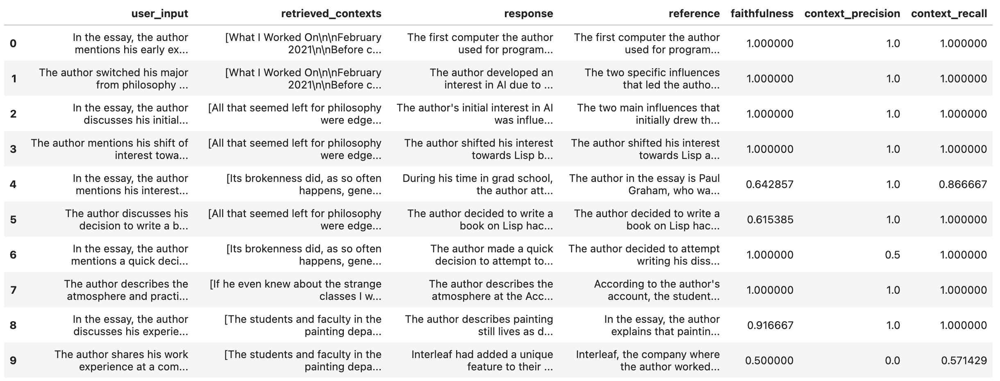
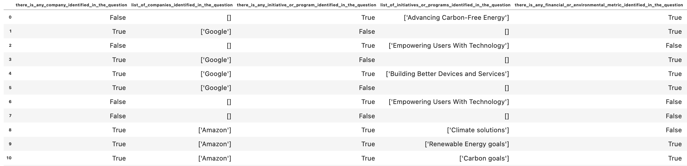
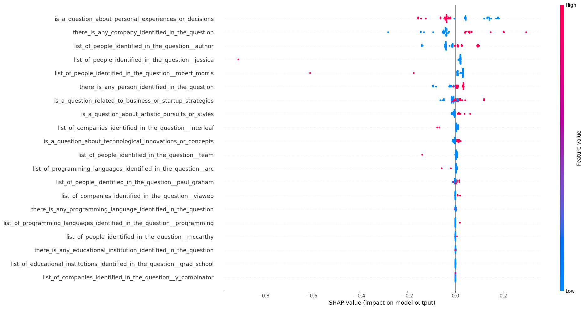
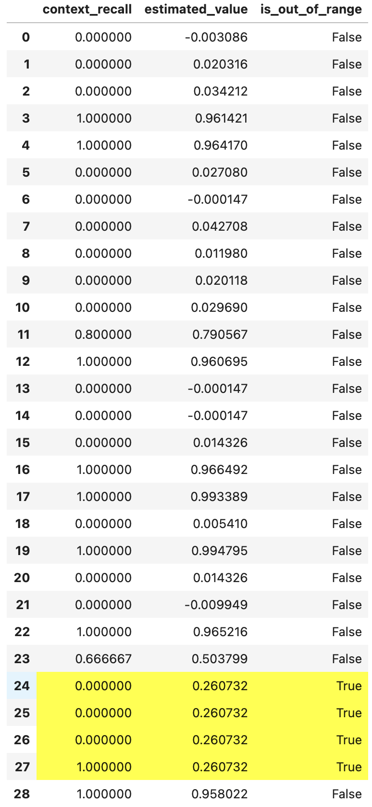
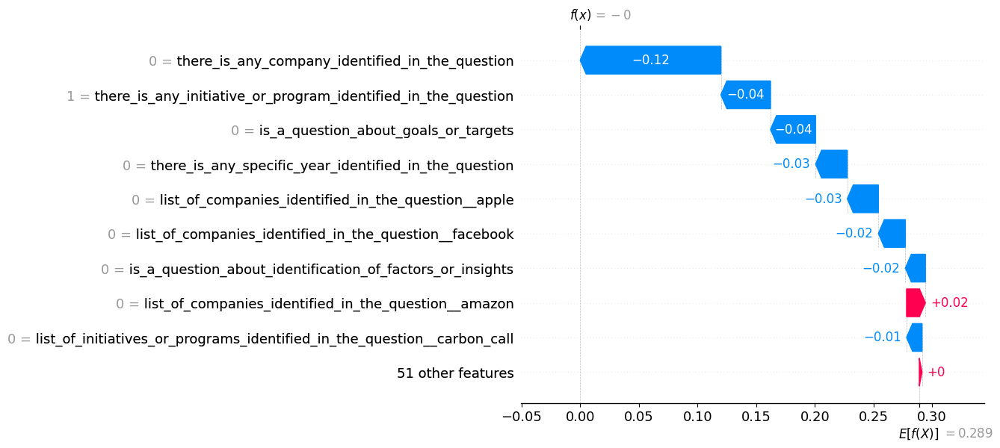

<h1 align="center">
    
</h1>
<h1 align="center">
    <b>GAISHAP</b>
</h1>
<h4 align="center">
    <i>Explainations for Generative AI, LLM-and-SLM-Based, Solutions</i> ⚡️
</h4>

---

Generative AI SHAP (GAISHAP) is a python library that supports the creation of explanations for solutions based on LLMs (Large Language Models) or SLMs (Small Language Models). 

When building a LLM-or-SLM based solution one of the first challenges is how to measure the quality of the responses from the "Bot". Here, libraries like  [RAGAS](https://github.com/explodinggradients/ragas) or [promptflow](https://github.com/microsoft/promptflow) help on the evaluation of the quality of the solution by using metrics like **faithfulness**, **groundedness**, **context precision**, **context recall**, among others.

The next challenge is to add explainability to those quality metrics.  To answer questions like: 

- *What are the common characteristics of the user questions that produces good or bad **faithfulness**?*
- *What type of prompts produce better or lower **context recall**?*

The answer of those questions helps on the debugging of the overall solution and gives more insights to where to focus the next steps to improve the metrics.

***GAISHAP*** was created to fulfill that need. It works as follows.

### Input

***GAISHAP*** uses as starting point a simple evaluation dataset with at least the following columns:

- User input, question or prompt. Column name should be `user_input` and its type should be string.
- One column for each metric already calculated, for example **faithfulness**, **context precision**, **context recall**.  All numerical columns will be assumed to be a metric column.

Example of the input using the [Paul Graham Essay Dataset](https://llamahub.ai/l/llama_datasets/Paul%20Graham%20Essay?from=llama_datasets):

```python
import pandas as pd

df_test_dataset = pd.read_json('./test-dataset.json', orient='records')
df_test_dataset.head(10)
```



> In this example, the column `user_input` will be used to refer to the user prompt, and the columns `faithfulness`, `context_precision` and `context_recall` will be used as metric columns since those columns are numerical.

### Featurizer

***GAISHAP*** has an utilily to automatically create features from the `user_input` entries.  Those features, are characteristics of the user questions that will be used as regressors to train a blackbox model that will be used to calculate the explanations.  It is possible to manually add, remove, or modify those automatically generated features to improve the quality of the explanations.

The following is an example of how to automatically generate the features that will be used as regressors for the black-box model:

```python
from gaishap import Featurizer

# Loads the input from the df_test_dataset pandas DataFrame
featurizer = Featurizer.from_pandas(df_test_dataset)

# Creates the features automatically using only the user_input column
featurizer.create_features_using_azure_openai(deployment_name="gpt-4o", num_features=12)
```

The following are the features generated:

- there_is_any_person_identified_in_the_question
- list_of_people_identified_in_the_question
- there_is_any_technology_or_programming_language_identified_in_the_question
- list_of_technologies_or_programming_languages_identified_in_the_question
- there_is_any_company_or_organization_identified_in_the_question
- list_of_companies_or_organizations_identified_in_the_question
- is_a_question_about_personal_experiences_or_decisions
- is_a_question_about_technological_innovations_or_developments
- is_a_question_about_artistic_or_creative_processes
- is_a_question_about_business_or_startup_strategies
- is_a_question_about_educational_or_learning_experiences
- is_a_question_related_to_the_concept_of_invention_vs_discovery

> Currently, there are two types of features supported: **boolean** and **list of strings**.

Then, ***GAISHAP*** also includes another utility to automatically filling out the values for each user input for each feature. 

```python
featurizer.fill_out_features_using_azure_openai(deployment_name="gpt-4o", batch_size=20)
```

> The batch size is used to control how many user inputs will be filled out per LLM call, to avoid overflow of the total number of tokens of the deployed model used.

A sample of the output is the following:

```python
df_features = featurizer.to_pandas()
```



### Explainers

Once, the user input features and its corresponding values are defined, ***GAISHAP*** can start working on the next steps:

- Feature engineering
- Regression black-box model training
- Creation of SHAP explainers

```python
from gaishap import GenAIExplainer

gai_explainer = GenAIExplainer.from_pandas(df_test_dataset, df_features)

# Feature Engineering
gai_explainer.feature_engineering()

# Train black-box model and create explainers
gai_explainer.create_explainers()

print(gai_explainer.r2_scores_)
```

The following are examples of the coeficient of determination (r2) scores for each of the best model trained for each metric:

- **faithfulness**: 0.918
- **context_precision**: 0.894
- **context_recall**: 0.900

> During the training and selection of the best models a **t-test** is performed to evaluate if the estimated metric using the models produces a statistically related sample from the same population of the original metric: fail to reject the null hypothesis that both, the original metric and the estimated metric are sanples from the same population. If the t-test rejects the null hypothesis a warning message is displayed during the creation of the explainers.  The explainers cannot be used as reference. 

> Also, as a rule of thumb, if the `r2_score` is high (>0.75) the explanations of black-box model could be used as reference. If it is lower, the use of the explainers could produce misleading conclusions.

The following is an example of how to use the explainers for the **context_precision** metric for the full dataset:

```python
metric = 'context_precision'

X = pd.DataFrame(gai_explainer.preprocessed_features)
metric_explainer = gai_explainer.explainers_[metric]
shap_values = metric_explainer(X)

shap.summary_plot(shap_values, X, plot_size=(20,10))
```

The following is the SHAP Summary Plot generated:



> From this plot we can conclude, for example, that the **context precision**:
> - Is higher in questions where Paul Graham is mentioned explicitely.
> - In contrast, questions that have mentions of "Interleaf", "Robert Morris", "Jessica" and the ARC programming languages have lower **context precision**.
> This type of information can be used as insights to guide next steps to improve the overall **context precision** of the solution.


During the creation of the explainers other warnings related to the safe use of the explainers can be raised. Warinings like:

> `UserWarning: There are 8 estimated values in the metric faithfulness too farm from the original values. The following is the list of indexes [3, 4, 5, 8, 18, 19, 39, 40].`

These warnings are show because during the creation of the training of the black-box model to create the explainers, there is a process to evaluate how far are the estimated values of each metric compared to the original one, using t-distribution and confidence intervals.  If an instance is out of the confidence interval it is marked as too far from the original value and the warning is shown to alert the user to use carfully the instance explanations for those specific instances.

The following table shows a comparison of the original metric values compared with the estimated values calculated using the black-box model, and the identification if the instance is **out of range** and therefore the explanations should be used carefully for those instances.



This type of table can be generated using a code like:

```python
df_metric = pd.DataFrame(gai_explainer.metrics)[[metric]]
df_metric['estimated_value'] = gai_explainer.estimators_[metric].predict(X)
df_metric['is_out_of_range'] = gai_explainer.is_out_of_range_[metric]

df_metric.style.apply(
    lambda s : [
        'background-color: yellow' if s.loc['is_out_of_range'] else '' for v in s.index
    ], 
    axis=1
)
```

The following is an example of how to produce explanations for an specific instance, **9th instance** of the **faithfulness** metric, which is not out-of-range:

```python
metric = 'faithfulness'

metric_explainer = gai_explainer.explainers_[metric]
shap_values = metric_explainer(X)

index = 9
shap.waterfall_plot(shap_values[index])
```

The generated plot is:



> From this plot we can conclude that the reduction of the **faithfulness** for this specific instance was mainly driven by the mention of "Interleaf" and because it is a question about technological innovations and developments.
> This type of information add insights at the instance level on how to improve the overal quality of the solution.

## Example Notebooks

The following are the steps to be able to execute the example notebooks

### Prerrequisites
- Install docker desktop: [https://www.docker.com/products/docker-desktop/](https://www.docker.com/products/docker-desktop/)
- [Only for Windows] Install Make for Windows: [https://gnuwin32.sourceforge.net/packages/make.htm](https://gnuwin32.sourceforge.net/packages/make.htm)

### Installation steps

1. Clone this repo locally: [https://github.com/microsoft/dstoolkit-genai-shap](https://github.com/microsoft/dstoolkit-genai-shap)
   > `git clone https://github.com/microsoft/dstoolkit-genai-shap.git`
2. Build gaishap image:
   > `cd dstoolkit-genai-shap`
   > 
   > `make build-image`
3. Create `.env` file by copying the `.env.template` file:
   > `cp .env.template .env`
4. Edit `.env` file and update the environment variables.
5. Run gaishap container and open jupyter lab url:
   > `make run-container`
   > 
   > Open the jupyter lab url by copying the line in the log that looks like:
   > 
   > `http://127.0.0.1:8888/lab?token=8a3eb1ebf39038598e0b6ce7cc400bf841b2b3891998ceb4`
   > 
   > and open it in a local web navigator like Microsoft Edge.
6. Execute the following notebooks under the `docs/examples` folder and follow the steps:
   * `01-create-test-dataset.ipynb`
   * `02-gaishap-featurizer.ipynb`
   * `03-gaishap-blackbox-model.ipynb`


## Contributing

This project welcomes contributions and suggestions.  Most contributions require you to agree to a
Contributor License Agreement (CLA) declaring that you have the right to, and actually do, grant us
the rights to use your contribution. For details, visit https://cla.opensource.microsoft.com.

When you submit a pull request, a CLA bot will automatically determine whether you need to provide
a CLA and decorate the PR appropriately (e.g., status check, comment). Simply follow the instructions
provided by the bot. You will only need to do this once across all repos using our CLA.

This project has adopted the [Microsoft Open Source Code of Conduct](https://opensource.microsoft.com/codeofconduct/).
For more information see the [Code of Conduct FAQ](https://opensource.microsoft.com/codeofconduct/faq/) or
contact [opencode@microsoft.com](mailto:opencode@microsoft.com) with any additional questions or comments.

## Trademarks

This project may contain trademarks or logos for projects, products, or services. Authorized use of Microsoft
trademarks or logos is subject to and must follow
[Microsoft's Trademark & Brand Guidelines](https://www.microsoft.com/en-us/legal/intellectualproperty/trademarks/usage/general).
Use of Microsoft trademarks or logos in modified versions of this project must not cause confusion or imply Microsoft sponsorship.
Any use of third-party trademarks or logos are subject to those third-party's policies.
